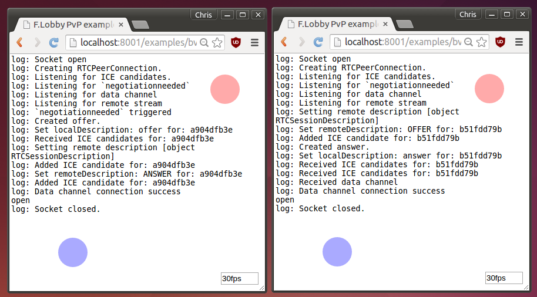

# F.Lobby tutorial
Making a PvP HTML5 game using WebSocket and PeerJS (WebRTC).

## Introduction
Player-vs-Player (PvP) is a form of multiplayer gaming which only 2 peers are involved. Games with PvP feature are typically in the action or strategy genre.

PvP gaming is a pure client-side thing. A server is not necessary, and if one exists, it is only responsible for communication, not game logic. This is different from MMO gaming where the server hosts the game and dictate all game states.

The two clients are perfectly synchronized, which means that the game state is deterministic. At any time, the next state is completely determined by the current state and given inputs.

A lobby is used to pair up players. F.Lobby provides a simplistic lobby. Any method can be used as long as it can let a client knows the player id of its opponent.

WebSocket is good, but hosting a WebSocket server for real time gaming can be costly and difficult. Especially for indie or hobby developers. That's why F.Lobby let you chooses between WebSocket and PeerJS (WebRTC). WebRTC is peer-to-peer communication in a browser. Clients communicate directly, without intermediate proxies. That means a high bandwidth, low latency multiplayer server is not needed.

## Getting started
Download or clone the [F.Lobby](https://github.com/Project-F/F.Lobby) repository. Run
```
npm install
```
Start F.lobby by
```
nodejs index.js --public
```
If you want a PeerJS version, do
```
nodejs index.js --peerjs --public
```
Open [http://localhost:8001/examples/bvb2.html]() or our demo on [lobby.projectf.hk](http://lobby.projectf.hk/examples/bvb2.html) in two windows. Login, say something, click a player's name and start game. If you see 'success' in the log messages, you should have two circles of different colors on the screen, which you can control one of them by mouse or touch. The other is controlled by your peer.

That's it. Such an underwhelming example, but it demonstrates the essence of PvP gaming.


## Coding
First require the two scripts
```JavaScript
requirejs(['lobby_helper', 'network'],function(lobby, network){
```
Then create a lobby window in an iframe
```JavaScript
lobby.create(
	document.getElementById('lobby'),
	server_address,
	room,
	setup);
```
setup will be called when pairing is successful. Then you should do some setup work for your game as well as the network library
```JavaScript
function setup(config)
{
	document.getElementById('lobby').style.display='none';
	//...
	network.setup(config, monitor);
	network.setInterval(frame, 1000/30);
}
```
implement the synchronized frame. It will be largely the same as your non PvP version, but in addition you receive the data from the other peer and apply to your game logic and send back some data as well.
```JavaScript
function frame(time, data, send)
{
    if( send) {
    	// do something with data
	}
	//your game logic
    if( send) {
    	send({..}); //send synchronization data
    }
}
```

## References
- F.Lobby is used by [F.LF](http://www.projectf.hk/F.LF/), a 2D fighter (Beat 'em up) game
- [network.js reference](http://www.projectf.hk/F.LF/core/docs/network_docs.html)
- [F.Lobby Reference](lobby_ref.md)
- [F.Lobby Specification](lobby_spec.md)
- Need help? Post your questions to
[https://github.com/Project-F/F.Lobby/issues]()
